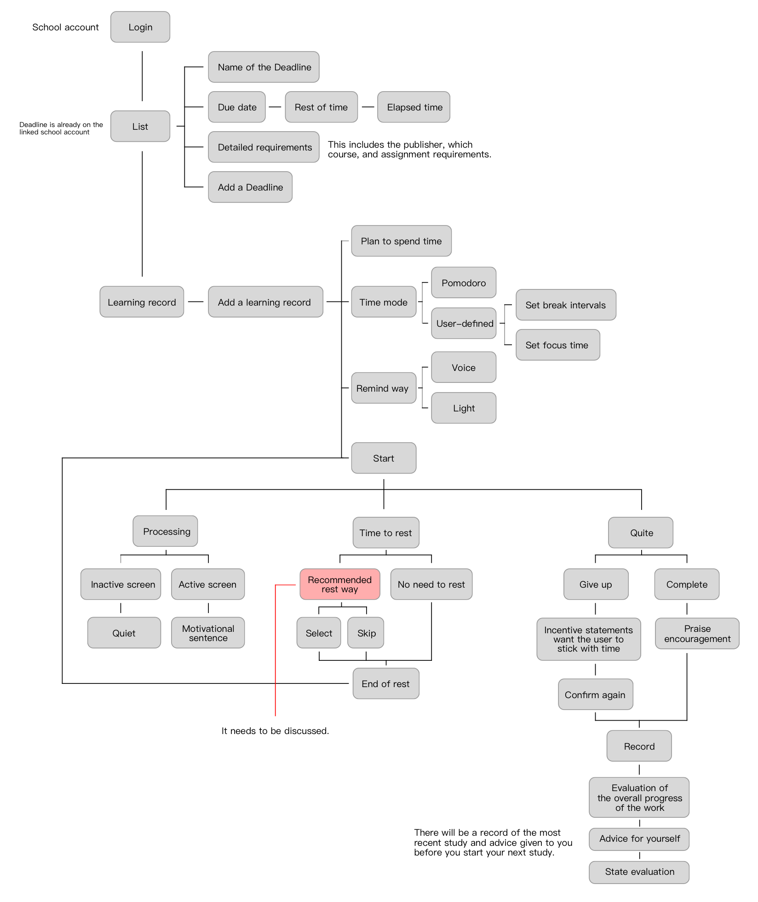
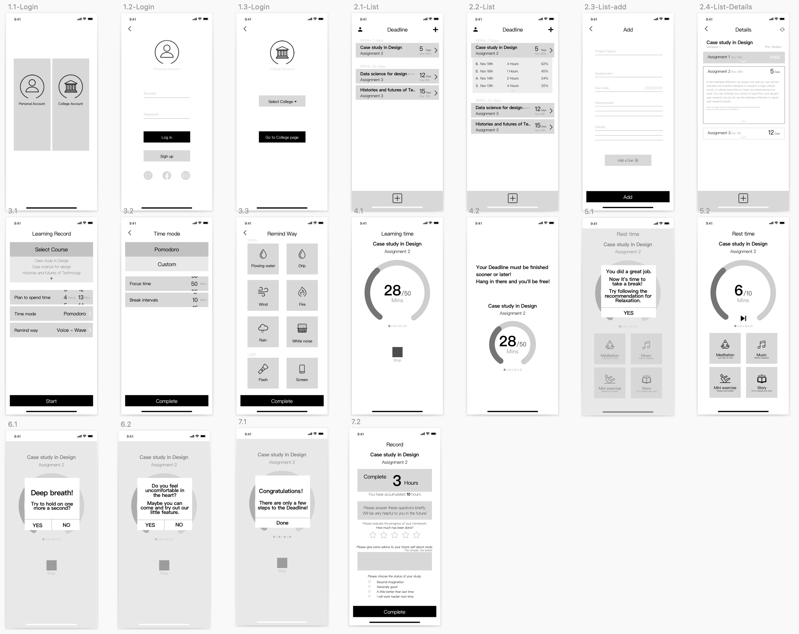
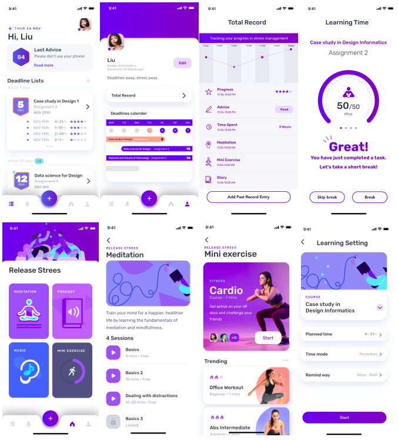

```toc
```

*This was a group project for the Case Studies in Design Informatics Postgraduate course at the University of Edinburgh.*

## Introduction

Chronic stress among college students is an increasing concern. They experience
various stressors, including changes in lifestyle, increased workload, new
responsibilities and interpersonal relationships. It is true that stress is an inevitable
part of life and some levels of stress can actually be beneficial — it can encourages
students to change and grow. However, when stress exists for an extended period of
time and exceeds students' adaptive capacity, it can negatively impact health and well-being. 
For example, chronic stress affects the immune system and increases
susceptibility to infection and illness. It also affects a diverse range of physical,
psychological and behavioral conditions, such as cognitive functions, memory, and
learning efficiency and sleep disorders.

This project aims to explore this area which would help students to manage their stress levels.
We followed a design thinking approach, iteratively learning more about the problem and those 
who experience and using this to inform our designs.
We begun with a literature review further
exploring mechanisms of stress in particular amongst students as well as existing
technologies. In the second stage, we planned and conducted user research to track and reflect on
data from university students. We then gathered ideas about how to
deliver calming social interventions for students' use, and finally come up with a
solution that enables college students to connect socially in order to mitigate chronic stress.

<div class="gatsby-resp-image-iframe">
    <video preload="none" width="100%" height="auto" controls>
      <source src="/videos/csdi/csdi_demo.mp4" type="video/mp4" />
        Your browser does not support the video tag.
    </video> 
    <p class="gatsby-resp-image-figcaption">Video of our final app design and features.</p>
</div>

## User Research

We conducted semi-structured interviews with 11 university students to
explore college stress. Before the interview, a script containing five questions
was created to identify:

* What situation causes stress
* Why this situation stressful
* How students manage stress
* How stress affects their daily lives
* How students perceive stress.

During the interview, all participants
volunteered to discuss their experiences, and all interviews were conducted
individually and transcribed.

In thematic analysis, striving to meet assessment
deadlines was mentioned by 45% of the participants, becoming a major
source of stress. The factors causing stress in this situation include **heavy**
**workload, time management issues, and fear of failure**. Stress management
strategies vary from student to student. Some participants regarded
deadlines as a manageable challenge, they make a list and work through it;
while some participants regarded deadlines as an overwhelming task and
experience emotional hardship resulting from their procrastination habits. In
this way, we decided to design an artefact to support deadline and stress
management for university students.

## Literature Review

Following the user research, we discussed and brainstormed ideas for 
areas to look further into. From the available literature, stressors that contribute to
the stress experienced by students come from four areas: academic
commitments, the transition to university, being in a different country, and
financial issues. Without a healthy attitude towards stressors,
students can be plagued with crippling bouts of stress. Our project aims to
help university students gain resilience against stress.

[Cockton][1] discusses the design process using a vocuabulary of "a_tefacts", 
which describes what we produce (artefacts) and have produced (antefacts).
Firstly, many studies have
demonstrated that technology can be a promising medium for delivering
stress interventions in the form of mobile applications, sensors and
biofeedback, virtual environments, and responsive environments and objects.
The antefact was initially designed to combine
sensors for capturing physiology with mobile application for stress regulation.
Some approaches (e.g.,
heart rate) provide relatively direct and accurate measurements of stress with
the challenge of intrusiveness, while other approaches (e.g., skin conductivity)
rely on secondary physiological signals at the cost of fidelity.
However, further research shows that the extensive use of sensors is not
suitable in the university context.

[M.C. Schraefel][2] proposes "insourcing" to awareness of bodily signals as opposed to
outsourcing to tracking and external artefacts. In this way we can build
knowledge and practices that help us to maximise our wellbeing by tuning our
behaviours rather than relying on external signals. For higher education
institutions, the need to find more interventions addressing student problems
with stress that are inexpensive, easy to implement, and can be used in many
different settings continues to exist,
while sensors limit the usage scenarios and cost more. **Therefore, the artefact**
**is a mobile application that can help university students reduce academic stress.**

[Cockton's][1] process also recognises anyficiaries: beneficiaries whose situations are improved
and maleficiaries who are made worse off. 
Beneficiaries here include university students and
professionals, who benefit from stress management.
As for maleficiaries, students with mental illness are considered. A study
demonstrates that these students seemed to give more meaning to stress
data than it deserved, and often found that the representation of the data did
not match their experiences [(Kelley, Lee and Wilcox, 2017)][3]. This is why we
use self-reflection as the proxy for stress management instead of sensing
technologies.

## Exploration

The next design area is in providing stress interventions in the app.
The IT-supported coping strategy framework
proposed by [(Fellmann et al. (2018))][5] suggests using problem-oriented and/or
emotional-oriented coping as stress reactions. We referred to the thematic
analysis, in which heavy workload, time management issues, fear of failure
have been identified as main factors causing stress. Given the inevitable
workload, task management and time management are problem-oriented
approaches to eliminate stressors and redirecting negative thoughts is an
emotion-oriented approach to improve cognitive appraisal.

The first function
of our system is multitasking and time management. We aimed to guide students 
to have better study plans and manage their time effectively. 
The second function is the provision of coping tools, 
including meditation, music, mini exercise and podcasts. The reason for
including different tools is that students tend to prefer tailored coping strategies that
enable them to adapt to academic-specific situations. 
The third function is self-reflection. Students can reflect on
their study status by logging a brief description and rating their mood using a
5-point emotion scale. Prior work has indicated that conscious reflection and
self-tracked mood can promote deeper insight into their behaviors, draw
broader lessons for the future, and promoted more successful behavior [(Hollis,
Konrad and Whittaker, 2015)][4].

## Development

To integrate these functions into one system, we produced a workflow. This
chart shows how the user will progress through the app from sign up to the
study companion and stress relief elements. This was useful in organising our
ideas from the research.



We now had a deep understanding of the problem, from the anyficiaries and
a_tefacts in Cockton's model to the stressors and coping techniques suggested for students
in our research. Building on this we begun the ideation by realising our workflow
as a low fidelity wireframe. This provided a reference to iterate on as we started to 
design the layout and interaction. Keeping this design simple and achromatic ensured
we and the participants in user tests focused on the bigger picture of the design
at this stage.



As we iterated on the design, we started to add colour and images to include more
consideration of the visual design elements. We wanted the app to be friendly 
and appeal to our student users, while also being clear and simple.



## User Testing

The first usability test was
conducted within the team using lo-fi prototypes to go through the workflow
and improve the interface design. We identified initial usability issues such as
naming and grouping of features.

Later, a second usability test was conducted
using hi-fi prototypes and invited three participants to evaluate the artefact.
The plan included four tasks: setting learning plan, pausing learning during the
timing process, experiencing one coping tool, and completing self-reflection.
According to participants’ feedback, we added an entry to coping tools on the
home page, so stress interventions can be available in any stressful
situations.

## Design

Our final design was realised as a Figma prototype and the promotional
video above.

<div class="gatsby-resp-image-iframe">
    <iframe style="border: 1px solid rgba(0, 0, 0, 0.1); width: 90%;" height="800" src="https://www.figma.com/embed?embed_host=share&url=https%3A%2F%2Fwww.figma.com%2Fproto%2FicwUkfPBHFaIq6R4lnlJqB%2FCSDI%3Fnode-id%3D85%253A55%26scaling%3Dscale-down" allowfullscreen></iframe>
    <p class="gatsby-resp-image-figcaption">Interactive Figma prototype of our app design.</p>
</div>


## Future Work

Further efforts are needed in the following areas. The first area of focus is the
availability of institutional support services to better help individuals to deal
with stress. The lack of information about these services and the fear of the
stigma attached if they receive support are two reasons why students rarely
seek help for stress-related problems. Our app will serve
as the bridge between institutions and students to provide online
interventions that are easily accessible, available 24/7 and permitting users to
remain anonymous without needing to adopt a patient role. 

Additionally, some participants expressed a desire to reduce demands for deliberate
reflection and mood logging using emerging sensing technologies, we would
caution against them being adopted. This is because prior work has
highlighted that conscious reflection is an important facilitator of behavior
change [(Hollis, Konrad and Whittaker, 2015)][4]. Importantly, we need to explore
further to avoid self-reflection itself becoming a source of stress in the future.


[1]: <https://dl.acm.org/doi/10.1145/3027063.3052755> "New Process, New Vocabulary: Axiofact = A_tefact + Memoranda"
[2]: <https://dl.acm.org/doi/10.1145/3290607.3312977> "in5: a Model for Inbodied Interaction"
[3]: <https://dl.acm.org/doi/10.1145/3025453.3025750> "Self-tracking for Mental Wellness: Understanding Expert Perspectives and Student Experiences"
[4]: <https://dl.acm.org/doi/10.1145/2702123.2702196> "Change of Heart: Emotion Tracking to Promote Behavior Change"
[5]: <https://dl.acm.org/doi/abs/10.1145/3266157.3266223> "IT-supported Stress Management: Mediating between Sensor Data and Individual Appraisal"