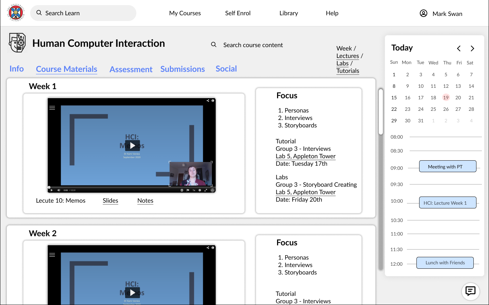
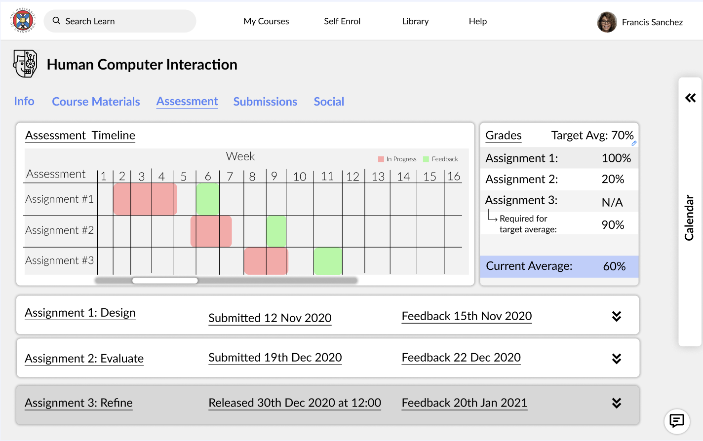

import MdxImageCarousel from "../../../components/mdxImageCarousel"


import assessment_current from "./hci/current/assessment.png"
import course_materials_current from "./hci/current/course_materials.png"
import course_materials1_current from "./hci/current/course_materials1.png"
import piazza_current from "./hci/current/piazza.png"

import discussion_redesign from "./hci/redesign/discussion.png"
import discussion1_redesign from "./hci/redesign/discussion1.png"

import memo_im from "./hci/memo.png"
import memo1_im from "./hci/memo1.png"

```toc
```

*This was a group project for the Human-Computer Inteaction course at the University of Edinburgh.*

## Introduction

This project is a redesign for Learn, the virtual learning environment website at the University of Edinburgh.
We focused on redesigning three pages: assessment, course materials and discussions for a template course,
aiming to improve consistency and usability.

## Personas

These were provided for the project.

### Cameron Jones

**Background and Study Choice**

* 4th year undergraduate student from
Glasgow, Scotland
* Moved to Edinburgh three years ago
when started their degree and made a lot
of friends in their cohort
* Working towards a BSc Hons in Computer
Science and has taken many courses in
Informatics before
* Year rep for their programme, so
understands how the department works
* Has had to do special circumstances
before because they got sick and had to
visit the doctor when a coursework was
due

**Challenges and Pains**

* Has to balance working on their honours project (40 credits project running
over sem 1 and 2) with taking courses and completing coursework.
* Took up the role as a year rep, which makes their time management
challenging since they have to attend weekly meeting and balance their
own needs with the needs of fellow students.
* Does not worry about a money since they receive a regular student loan.
* Is very annoyed that the old way of submitting through the terminal was
replaced by Learn and TurnItIn. They liked the easy way of submitting files
through dice since it always worked well for them.

**Goals**

* Would like to achieve a first-class degree. They are on a good track but need
to get good grades this year to achieve it.
* Wants to plan out coursework deadlines in advance so they can manage
their time

**Devices**

* Uses their own Linux laptop or the school’s linux based computers since
they value efficiency and want the quickest access to content.
* Has an Android smartphone which they used for TopHat attendance in past
years, but rarely use it for anything else course-related

### Francis Sanchez

**Background and Study Choice**

* Mature Master Student from Cusco, Peru
Studies for a MSc in Artificial Intelligence
* Has been working at Company X before
their degree and must go back to
Company X after graduation since they pay
for their tuition.
* Moved here with their partner and two
children and live a bit outside of the city
centre.
* Was surprised at the amount of student
participation in lectures since at
their previous university it was uncommon
to have tutorials or labs.

**Challenges and Pains**

* Arrived a week late because of Visa issues and missed the first lectures of
each class.
* Pressure to achieve an average of 70% to satisfy the requirements of their
scholarship
* Has to travel to classes by bus, so any short notice adjustments or
cancellations are hard to deal with.
* Having learned mainly American English, adjusting to the local accent is
challenging.
* Despite their partner taking care of most things, they still struggle to balance
academic work, networking, and parental responsibilities.


**Goals**

* Wants to make the most out of the courses here and audits quite a few
courses as well.
* Wants to give their children the opportunity to see something of Scotland as
well. So, they plan a couple of weekend trips.
* Very keen to learn more of the Scottish culture and tries to attend some
socials

**Devices**

* Uses their company provided Windows laptop for coursework and notes.
* Has an Android smart phone but prefers to use it for calls and messages only.

## Current Design

This is a selection of screenshots of the current Learn website for a typical course.
It shows the assessment and course materials page, as well as Piazza which is an
external discussion board website.

<MdxImageCarousel caption={"Original page designs"}>
  {assessment_current}
  {course_materials_current}
  {course_materials1_current}
  {piazza_current}
</MdxImageCarousel>


## Key Observations

Our team used Miro to cluster our collective
memo contributions under key themes. The affinity diagram we used brought
to our attention many significant observations that ultimately helped define our
problem definitions and design requirements.

First, we observed that the personas were especially concerned about the
content organisation on Learn. Many of our memos mentioned that students
were frustrated by the lack of consistency between different courses and often
found it difficult to access the information that they needed due to Learn’s
nested sub-folder structure. We also identified that different personas would
benefit from course materials being presented in varying formats, for example,
live sessions may not work if the persona has children playing in the background
and lecture notes should be recorded or available in text format because some
students may have difficulty understanding local accents.

Second, we identified that many personas were worried about time management
and would benefit from a calendar-based format that included important
information such as coursework deadlines, lecture dates and tutorial meeting
times. We also noted that our personas may have challenges finding their way
around campus, especially first-years and new international exchange students.
Therefore, integrating some kind of interactive map that displays approximate
travel times to lectures and tutorials could be helpful for students managing their
time commitments, specifically during the initial weeks of the first semester.

Lastly, we observed that personas could benefit from integrating a social feature
into Learn for communicating with friends, course organisers and lecturers.
We also observed that some students use Learn for auditing courses and therefore
it was important for each course to contain some high-level information
e.g. learning outcomes, course contacts.

<MdxImageCarousel caption={"Memo combination result"}>
  {memo_im}
  {memo1_im}
</MdxImageCarousel>

## Problem Definition

The key problem we identified during our memo taking was that the information
on Learn is not easily absorbed, it is not clear when deadlines are or how
much work is expected. After we had grouped together our memos under
common themes, this problem became immediately apparent as it had the
greatest number of memos ascribed to it. Some of these memos were addressing
the fact that both personas would benefit from being able to plan out their
schedule ahead of time so that they can work around external commitments
such as having a family or balancing work with other courses.

Other memos
were from interviews with students using the current version of Learn who
came to the conclusion that the location of information on Learn is not
consistent throughout courses. This could be as simple as links to important
content not being obvious or it could be a result of content being repeated under
multiple tabs with subtle differences between them, leading to confusion.

## Design Requirements

Based on our user interviews, personas and problem definition we developed the
following design requirements during design iteration:
* Easily and clearly organised course content: this is the primary goal of
the platform informed from the problem definition.
* Supports time management: consistency and clarity for balancing university
work with other activities from socialising to childcare.
* A way to see grades and feedback with clarity of assessment expectations:
both personas wanted good grades and some students need to
meet academic requirements for sponsorship.
* The ability to explore courses on Learn before taking it as well as being
able to audit courses: this is a different use case that requires a different
focus with the content structure.
* International and first year students don’t know their way around the city
so making locations simple and easy to navigate from Learn.
* Social aspect: a way to nurture the social relationships that are a key
aspect of the university experience especially with the increasing
prevalence of online learning during the COVID-19 restrictions.

In terms of the content of the course site we used the following requirements.
These were also informed by the
[Learn Foundations](https://blogs.ed.ac.uk/website-communications/the-elements-of-a-better-user-experience-in-learn/)
study where a similar set of menu items evaluated well in
both card sorting and task analysis.
* Course information including exam / coursework weighting, level, credits,
learning outcomes and course contacts.
* Course materials with the schedule of content and a way to access tutorials
and lecture recordings
* Assessment information and gradebook
* Coursework submission

## Design Reasoning

### Course Materials

In order to address the key problem of having information be easily absorbed,
the course materials page has been structured by week and delivers everything
you need to know in one place. The "Focus" section on the right-hand side directly
informs the student of the topics that will be covered for that week as
well as linking any content that they need to complete. Furthermore, by having
the recorded lectures available it allows students to easily catch up on content
they might have missed.

By having the calendar on the right-hand side it gives a visual and interactive
way for students to view what deadlines are upcoming but more
importantly it informs them of exactly what is scheduled for today, an excellent
feature for those who are juggling heavy workloads like the persona Cameron
Jones.

This format also makes it easy for students auditing the course to keep up
with the course content, as well as allowing students to plan ahead and schedule
plans for the weekends they are free (attending to the needs of the persona
Francis Sanchez).

In addressing the requirement that new students have difficulty finding
locations, we added text locations within the week view that link to an embedded
map page, making it easy for students to find their way around.



### Assessment

A major takeaway from the memo stage was that students want to be able
to manage their time better, for example, the Cameron Jones persona. We
addressed this problem by adding an Assessment Timetable at the top of the
page giving an immediate feel for the timescales involved with each coursework.

One of the design requirements is a way to see grades and feedback clearly.
In order to address this we added the Grades section on the top right of the
page. Both personas are aiming to
achieve high grades, in order to help them plan for this we added the Target
Average feature. The target grade can be modified by clicking the blue pencil
icon beside the percentage. For example, Francis Sanchez has to achieve an
average of 70% to satisfy the conditions of their scholarships. The page will
now calculate the grades they need to achieve in future assignments, while
also displaying their current average.

Another requirement was clarity about assessments. In response to this
we included all the coursework assignments in the bottom of the page. Each
coursework element is either white - to indicate that it has been released - or
greyed out - to indicate that the coursework has yet to be released. Coursework
can thus be understood at a glance and each white element is expandable to
reveal coursework descriptions.




### Social

We identified from the memo collaboration task that Learn could benefit
from having its own social feature. Students were often frustrated with having
to use multiple platforms - e.g. using Piazza for discussion forums, Microsoft
Outlook for emailing course organisers and Facebook messenger for organising
group chats with course friends. Our idea is to bring all of these requirements
under Learn and to develop an all-in-one platform for university social communication.

First, we have a Piazza-style class discussion forum at the centre of the social
page. This feature allows students to submit questions and answers to the class and also
contains attributes such as, the ability to save posts and reply with comments.

Second, we have added a private message feature pinned to the bottom right-hand
screen for staff and students to communicate on Learn. From the Cameron Jones
persona we identified that students get in contact with staff (i.e. class rep) or
reach out to classmates for course-related questions. We believe this feature is
especially important given the restrictions with Covid-19 and the importance of
building social relationships to the university experience.

<MdxImageCarousel caption={"Redesigned discussion page"}>
  {discussion_redesign}
  {discussion1_redesign}
</MdxImageCarousel>